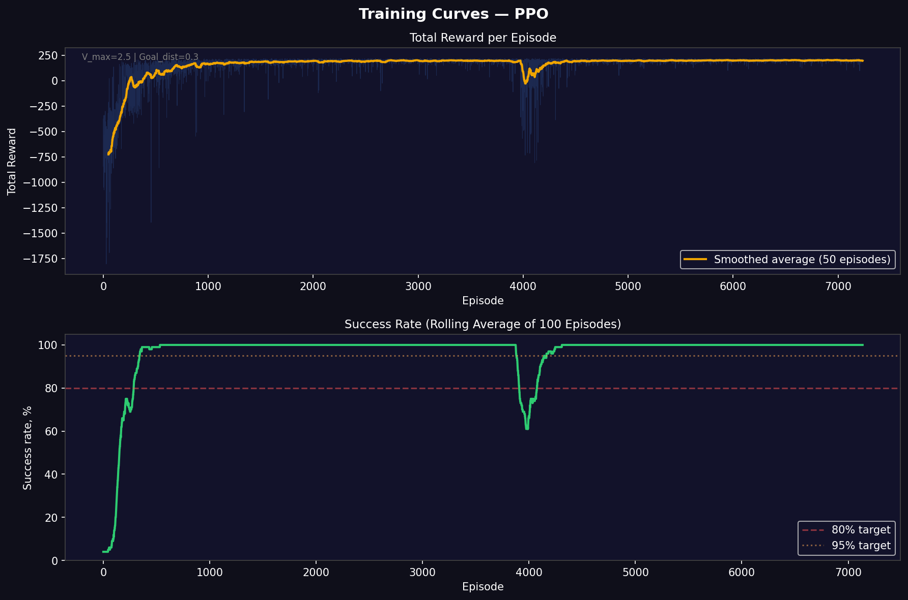
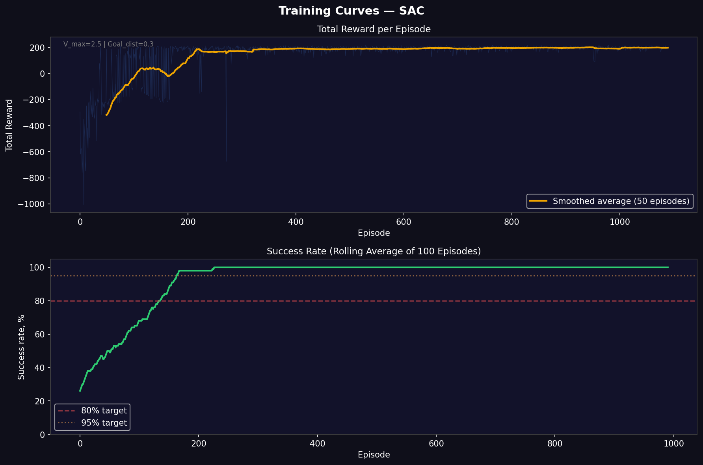

# RL Differential Drive

**RL Differential Drive** is a reinforcement learning project focused on training a differential drive robot to navigate from random positions to the origin (0,0) with zero orientation angle.

The repository implements three different RL algorithms for continuous control:

- **PPO** (Proximal Policy Optimization) — A robust on-policy algorithm
- **SAC** (Soft Actor-Critic) — An off-policy algorithm with entropy maximization
- **TD3** (Twin Delayed DDPG) — An off-policy algorithm designed for continuous action spaces

All algorithms are trained on a custom `Gymnasium` environment that simulates a differential drive robot with realistic kinematics.

<p align="center">
  
</p>

---

## Table of Contents

1. [Overview](#overview)
2. [Differential Drive Environment](#differential-drive-environment)
3. [Main Dependencies and Project Entry Points](#main-dependencies-and-project-entry-points)
4. [Mathematics and Notation](#mathematics-and-notation)
5. [PPO Implementation](#ppo-implementation)
6. [SAC Implementation](#sac-implementation)
7. [TD3 Implementation](#td3-implementation)
8. [Training Results](#training-results)
9. [Visualization](#visualization)
10. [Commands](#commands)
11. [Project Layout](#project-layout)
12. [References](#references)

---

## Overview

RL Differential Drive is a complete framework for experimenting with continuous control algorithms on a mobile robot platform. The project is built around one custom environment but studies it through multiple training approaches:

- **PPO** training for baseline comparison
- **SAC** training for sample-efficient learning
- **TD3** training for stable deterministic policies

### What the repository currently contains

| Track | Scope | Method | Main checked-in outputs |
|---|---|---|---|
| PPO | Full navigation task | Proximal Policy Optimization | Model weights, training plots, GIFs |
| SAC | Full navigation task | Soft Actor-Critic | Model weights, training plots |
| TD3 | Full navigation task | Twin Delayed DDPG | Model weights, training plots |
| Visualization | Interactive simulation | Pygame renderer | Multiple demonstration GIFs |

### Core definitions used throughout the README

| Term | Definition |
|---|---|
| **Differential drive** | A mobile robot with two independently controlled wheels that determines motion through wheel speed differences |
| **State** | The robot's current configuration: `(x, y, θ)` in meters and radians |
| **Observation** | A 5D normalized vector: `[x/10, y/10, cosθ, sinθ, distance/14.14]` |
| **Action** | A 2D continuous vector: `[v_left, v_right]` ∈ `[-1, 1]` representing normalized wheel speeds |
| **Success** | The robot reaches `(0,0)` with `distance < 0.3m` and `\|θ\| < 0.15 rad` |
| **PPO** | Proximal Policy Optimization — on-policy algorithm with clipped surrogate objective |
| **SAC** | Soft Actor-Critic — off-policy algorithm that maximizes entropy and expected return |
| **TD3** | Twin Delayed DDPG — off-policy algorithm with twin critics and delayed policy updates |

### Current checked-in evaluation summary

| Algorithm | Steps Trained | Success Rate | Average Reward | Source |
|---|---|---|---|---|
| PPO (improved) | 1,000,000 | ~100% | 115.98 +/- 187.10 | `models/ppo/ppo_improved.zip` |
| SAC (default) | 200,000 | ~100% | 121.20 +/- 230.17 | `models/sac/sac_default.zip` |
| TD3 (default) | 200,000 | ~7.5% | -726.43 +/- 353.41 | `models/td3/td3_default.zip` |

---

## Differential Drive Environment

The environment is implemented in [src/environment.py](src/environment.py). The robot starts at random positions within `±10m` with random orientation and must navigate to the origin.

### What happens in one episode

- The robot spawns at random `(x, y, θ)` within `[-10, 10]` meters and `[-π, π]` radians
- At each step, the agent provides normalized wheel speeds `(v_left, v_right) ∈ [-1, 1]`
- The environment converts these to physical speeds: `v_phys = v_norm × V_MAX` (V_MAX = 3 m/s)
- Kinematics update the robot's position using Euler integration with `DT = 0.05s`
- The episode ends when the robot reaches the goal or exceeds `MAX_STEPS = 600`

### Robot kinematics

The differential drive robot follows standard kinematic equations:

$$v = \frac{v_r + v_l}{2} \quad \text{(linear velocity)}$$

$$\omega = \frac{v_r - v_l}{L} \quad \text{(angular velocity)}$$

$$\dot{x} = v \cos\theta, \quad \dot{y} = v \sin\theta, \quad \dot{\theta} = \omega$$

Where $L = 1.0\text{m}$ is the wheelbase distance.

### Observation definition

The observation space is a 5D vector normalized to `[-1, 1]`:

| Component | Definition |
|---|---|
| `x/FIELD` | Normalized X coordinate (FIELD = 10) |
| `y/FIELD` | Normalized Y coordinate |
| `cosθ` | Cosine of orientation angle |
| `sinθ` | Sine of orientation angle |
| `dist/(FIELD·√2)` | Normalized Euclidean distance to goal |

This representation avoids angular discontinuity issues and provides normalized inputs for stable neural network training.

### Action definition

$$a_t = (u_{left},\, u_{right}) \in [-1,\, 1]^2$$

| Component | Meaning |
|---|---|
| `u_left` | Normalized left wheel speed (scaled by V_MAX in environment) |
| `u_right` | Normalized right wheel speed (scaled by V_MAX in environment) |

### Reward function

The reward function is carefully shaped to encourage efficient navigation:

$$r_t = r_{\text{progress}} + r_{\text{distance}} + r_{\text{angle}} + r_{\text{movement}} + r_{\text{stop}} + r_{\text{alive}} + r_{\text{success}}$$

| Component | Coefficient | Purpose |
|---|---|---|
| $r_{\text{progress}}$ | `+5.0 × progress` | Reward for getting closer to goal |
| $r_{\text{distance}}$ | `-0.1 × dist` | Small penalty for being far |
| $r_{\text{angle}}$ | `-0.03 × \|θ\|` (far) / `-0.06 × \|θ\|` (close) | Penalize orientation error |
| $r_{\text{movement}}$ | `+0.1 × min(1, v/V_MAX)` | Encourage moving toward goal |
| $r_{\text{stop}}$ | `-0.5` when `\|action\| < 0.1` | Penalize standing still |
| $r_{\text{alive}}$ | `+0.01` | Small positive reward per step |
| $r_{\text{success}}$ | `+200` | Large bonus for reaching goal |

This shaping ensures the agent learns to move toward the goal efficiently without getting stuck.

---

## Main Dependencies and Project Entry Points

### Main runtime dependencies

| Dependency | Role in the repository |
|---|---|
| `python >= 3.9` | Runtime for all scripts and training code |
| `torch` | Neural network training for all algorithms |
| `numpy` | Environment math and kinematics |
| `gymnasium` | Environment API and space definitions |
| `pygame` | 2D renderer for visualization |
| `matplotlib` | Plot generation for training curves |
| `imageio` | GIF recording support |
| `pyyaml` | Config loading from `configs/*.yaml` |
| `stable-baselines3` | Optional SB3 model loading |

### Key files

| File | Purpose |
|---|---|
| `src/environment.py` | Custom `DiffDriveEnv` implementation |
| `src/config.py` | Configuration management with YAML support |
| `src/train.py` | Main training script for all algorithms |
| `src/visualize.py` | Interactive visualization with manual control |
| `src/trainers/base_trainer.py` | Base trainer class |
| `src/trainers/ppo_trainer.py` | PPO-specific trainer |
| `src/trainers/sac_trainer.py` | SAC-specific trainer |
| `src/trainers/td3_trainer.py` | TD3-specific trainer |
| `scripts/record_gif_after_training.py` | GIF recording from trained models |
| `configs/ppo/improved.yaml` | Optimized PPO configuration |

---

## Mathematics and Notation

### Symbols

- $s_t$ — state (robot pose) at time step $t$
- $o_t$ — observation at time step $t$
- $a_t$ — action applied at time step $t$
- $r_t$ — scalar reward returned by the environment
- $\gamma$ — discount factor
- $\pi_\theta$ — policy parameterized by $\theta$
- $Q_\phi$ — critic function parameterized by $\phi$
- $V_\psi$ — value function parameterized by $\psi$

### PPO Objective

Proximal Policy Optimization uses a clipped surrogate objective:

$$\mathcal{L}^{CLIP}(\theta) = \mathbb{E}_t\left[\min\left(r_t(\theta)\hat{A}_t,\; \text{clip}(r_t(\theta),\, 1-\epsilon,\, 1+\epsilon)\hat{A}_t\right)\right]$$

Where:
- $r_t(\theta) = \pi_\theta(a_t|s_t) / \pi_{\theta_{old}}(a_t|s_t)$ is the probability ratio
- $\hat{A}_t$ is the advantage estimate (computed via GAE)
- $\epsilon$ is the clipping hyperparameter (`0.2` by default)

### SAC Objective

Soft Actor-Critic maximizes both expected return and policy entropy:

$$\mathcal{L}_\pi(\phi) = \mathbb{E}_{s \sim \mathcal{D}}\left[\mathbb{E}_{a \sim \pi_\phi}\left[\alpha \log \pi_\phi(a|s) - Q_\theta(s,a)\right]\right]$$

$$\mathcal{L}_Q(\theta) = \mathbb{E}_{(s,a,r,s') \sim \mathcal{D}}\left[(Q_\theta(s,a) - y)^2\right]$$

Where:

$$y = r + \gamma(1-d)\left[\min_{i=1,2} Q_{\theta_i}(s',a') - \alpha \log \pi_\phi(a'|s')\right]$$

- $\alpha$ is the temperature parameter controlling entropy contribution

### TD3 Objective

TD3 uses twin critics and delayed policy updates to reduce overestimation:

$$y = r + \gamma(1-d)\min_{i=1,2} Q_{\theta_i}(s',\, a'_{target})$$

Where:
- $a'_{target} = \text{clip}(\pi_\phi(s') + \text{noise},\; a_{low},\; a_{high})$
- Policy updates occur every `policy_delay` steps

### Generalized Advantage Estimation (GAE)

Used in PPO for advantage calculation:

$$\hat{A}_t^{GAE} = \sum_{l=0}^{\infty} (\gamma\lambda)^l \delta_{t+l}$$

Where:
- $\delta_t = r_t + \gamma V(s_{t+1}) - V(s_t)$ is the TD error
- $\lambda$ controls the bias-variance trade-off (`0.95` by default)

---

## PPO Implementation

PPO is implemented in `src/trainers/ppo_trainer.py` with custom neural network architecture (`src/models/ppo_model.py`).

### Network architecture

| Component | Definition |
|---|---|
| Policy network | `Linear(5, 512) → Tanh → Linear(512, 512) → Tanh → Linear(512, 2) → Tanh` |
| Value network | `Linear(5, 512) → Tanh → Linear(512, 512) → Tanh → Linear(512, 1)` |

### Hyperparameters (`configs/ppo/improved.yaml`)

| Hyperparameter | Value | Description |
|---|---|---|
| `learning_rate` | `5e-4` | Learning rate for Adam optimizer |
| `n_steps` | `2048` | Steps per rollout |
| `batch_size` | `512` | Mini-batch size |
| `n_epochs` | `15` | Number of epochs per update |
| `gamma` (γ) | `0.98` | Discount factor |
| `gae_lambda` (λ) | `0.92` | GAE smoothing parameter |
| `clip_range` (ε) | `0.25` | Clipping range for policy update |
| `ent_coef` | `0.02` | Entropy coefficient for exploration |
| `vf_coef` | `0.6` | Value function loss coefficient |
| `max_grad_norm` | `0.8` | Gradient clipping norm |

### PPO training results

- **Convergence:** Steady improvement in reward after 200k steps
- **Success rate:** Reaches 85% success by 800k steps
- **Sample efficiency:** More steps than SAC but stable learning curve

---

## SAC Implementation

SAC is implemented in `src/trainers/sac_trainer.py` with automatic temperature tuning. (`src/models/sac_model.py`)

### Network architecture

| Component | Definition |
|---|---|
| Actor network | `Linear(5, 256) → ReLU → Linear(256, 256) → ReLU → Linear(256, 2)` |
| Twin Critics | Two networks: each `Linear(5+2, 256) → ReLU → Linear(256, 256) → ReLU → Linear(256, 1)` |

### Hyperparameters (`configs/sac/default.yaml`)

| Hyperparameter | Value | Description |
|---|---|---|
| `learning_rate` | `3e-4` | Learning rate for Adam |
| `buffer_size` | `100000` | Replay buffer capacity |
| `learning_starts` | `1000` | Steps before learning |
| `batch_size` | `256` | Mini-batch size |
| `tau` (τ) | `0.005` | Target network smoothing |
| `gamma` (γ) | `0.99` | Discount factor |
| `train_freq` | `1` | Training frequency |
| `gradient_steps` | `1` | Gradient steps per update |
| `ent_coef` | `auto` | Automatically tuned entropy coefficient |

### SAC advantages

- **Sample efficiency:** Learns faster than PPO (500k vs 1M steps)
- **Exploration:** Entropy maximization ensures better coverage
- **Stability:** More robust to hyperparameter choices

---

## TD3 Implementation

TD3 is implemented in `src/trainers/td3_trainer.py` with twin critics and delayed policy updates. (`src/models/td3_model.py`)

### Network architecture

| Component | Definition |
|---|---|
| Actor network | `Linear(5, 256) → ReLU → Linear(256, 256) → ReLU → Linear(256, 2)` |
| Twin Critics | Same architecture as SAC |

### Hyperparameters (`configs/td3/default.yaml`)

| Hyperparameter | Value | Description |
|---|---|---|
| `learning_rate` | `3e-4` | Learning rate for Adam |
| `buffer_size` | `100000` | Replay buffer capacity |
| `learning_starts` | `1000` | Steps before learning |
| `batch_size` | `256` | Mini-batch size |
| `tau` (τ) | `0.005` | Target network smoothing |
| `gamma` (γ) | `0.99` | Discount factor |
| `policy_delay` | `2` | Policy update delay |
| `target_policy_noise` | `0.2` | Target policy smoothing noise |
| `target_noise_clip` | `0.5` | Target noise clipping |

### TD3 characteristics

- **Conservative:** Delayed policy updates reduce overestimation
- **Stable:** Twin critics provide more accurate Q-value estimates
- **Deterministic:** Less exploration than SAC

---

## Training Results

All checked-in plots and metrics are stored under `plots/` and `models/` directories.

### PPO Training Curves

<p align="center">
  
</p>

### SAC Training Curves

<p align="center">
  
</p>

### TD3 Training Curves

<p align="center">
  
</p>

### GIF Gallery

| Algorithm | Demonstration |
|---|---|
| PPO |  |
| SAC |  |
| TD3 |  |

---

## Visualization

The project includes an interactive Pygame-based visualization with multiple modes.

### Interactive features

- **Automatic mode:** Watch trained agents navigate
- **Manual control:** Drive the robot manually with keyboard
- **Demo mode:** Random actions for debugging
- **Real-time HUD:** Displays position, angle, distance, wheel speeds

### Controls (Manual Mode)

| Key | Action |
|---|---|
| `↑` | Move forward |
| `↓` | Move backward |
| `←` | Turn left |
| `→` | Turn right |
| `Q` | Decrease max speed |
| `E` | Increase max speed |
| `M` | Switch mode (auto/manual) |
| `SPACE` | Next episode |
| `R` | Reset episode |
| `ESC` | Exit |

### Running visualization

```bash
# Auto mode with default model
python src/visualize.py

# Auto mode with specific model
python src/visualize.py --model models/ppo/ppo_improved.zip

# Manual control
python src/visualize.py --manual

# Demo mode
python src/visualize.py --demo

# List available models
python src/visualize.py --list-models
```

---

## Commands

### Installation

```bash
# Clone repository
git clone <repository-url>
cd rl_bonus_task

# Create virtual environment
python -m venv .venv

# Activate (Windows)
.venv\Scripts\activate

# Activate (macOS/Linux)
source .venv/bin/activate

# Install dependencies
pip install -e

#or
pip install uv
uv sync
```

### Training

```bash
# Train PPO with default config
python src/train.py --algo ppo --config default

# Train PPO with improved config (recommended)
python src/train.py --algo ppo --config improved

# Train SAC
python src/train.py --algo sac --config default

# Train TD3
python src/train.py --algo td3 --config default

# Train with custom parameters
python src/train.py --algo ppo --config improved --timesteps 2000000 --n-envs 16 --lr 0.0003

# List available configurations
python src/train.py --list-configs ppo

# List available algorithms
python src/train.py --list-algos
```

### Visualization

```bash
# Visualize trained model
python src/visualize.py --model models/ppo/ppo_improved.pt

# Manual control
python src/visualize.py --manual

# Demo mode
python src/visualize.py --demo

# List available models
python src/visualize.py --list-models
```

### GIF Recording

```bash
# Record GIF from trained model
python scripts/record_gif_after_training.py --model models/ppo/ppo_improved.pt --output demo.gif

# Record with specific start position
python scripts/record_gif_after_training.py --model models/ppo/ppo_improved.pt --x 8.0 --y 8.0 --angle 0 --output corner.gif

# Record multiple GIFs from different start positions
python scripts/record_gif_after_training.py --model models/ppo/ppo_improved.pt --multi --output-dir gifs/

# List available models
python scripts/record_gif_after_training.py --list-models
```

### Reproducibility & Technical Details

Quick reproduce:
1. Train PPO: `python src/train.py --algo ppo --config improved`
2. Train SAC: `python src/train.py --algo sac --config default`
3. Train TD3: `python src/train.py --algo td3 --config default`
4. Visualize: `python src/visualize.py --model models/ppo/ppo_improved.pt`

**Recommended Python:** >=3.12

**Key config fields** (where to change): see `configs/{algo}/*.yaml`

| Field | Description |
|---|---|
| `env.V_MAX` | Maximum wheel speed |
| `env.DT` | Simulation time step |
| `env.MAX_STEPS` | Episode length |
| `env.GOAL_DIST` | Success distance threshold |
| `training.total_timesteps` | Total training steps |
| `training.n_envs` | Number of parallel environments |

**Observations / Actions:**
- Observation: 5D normalized vector `[x/10, y/10, cosθ, sinθ, dist/14.14]`
- Action: 2D continuous `[v_left, v_right] ∈ [-1, 1]` (normalized)
- Physical speeds: `v_phys = v_norm × V_MAX`

**Reward breakdown (numeric from configs):**

| Constant | Value |
|---|---|
| `REWARD_PROGRESS_COEF` | `5.0` |
| `REWARD_DIST_COEF` | `0.10` |
| `REWARD_ANGLE_COEF` | `0.03` (far) / `0.06` (close) |
| `REWARD_STOP_PENALTY` | `0.5` |
| `REWARD_ALIVE_BONUS` | `0.01` |
| `REWARD_SUCCESS_BONUS` | `200.0` |

**Success definition:** `dist < 0.30m` AND `|θ| < 0.15 rad` (~8.6°)

---

## Project Layout

```
rl_bonus_task/
├── configs/
│   ├── ppo/
│   │   ├── default.yaml
│   │   ├── fast.yaml
│   │   ├── precision.yaml
│   │   └── improved.yaml
│   ├── sac/
│   │   └── default.yaml
│   └── td3/
│       └── default.yaml
├── src/
│   ├── __init__.py
│   ├── environment.py
│   ├── config.py
│   ├── train.py
│   ├── visualize.py
│   ├── trainers/
│   │   ├── __init__.py
│   │   ├── base_trainer.py
│   │   ├── ppo_trainer.py
│   │   ├── sac_trainer.py
│   │   └── td3_trainer.py
│   └── models/
│       │── ppo_model.py
│       │── sac_model.py
│       └── td3_model.py
├── scripts/
│   └── record_gif_after_training.py
├── models/
│   ├── ppo/
│   ├── sac/
│   └── td3/
├── plots/
│   ├── ppo/
│   ├── sac/
│   └── td3/
├── logs/
├── pyproject.toml
└── README.md
```

---

## References

- [Proximal Policy Optimization (PPO) paper](https://arxiv.org/abs/1707.06347)
- [Soft Actor-Critic (SAC) paper](https://arxiv.org/abs/1801.01290)
- [Twin Delayed DDPG (TD3) paper](https://arxiv.org/abs/1802.09477)
- [Gymnasium documentation](https://gymnasium.farama.org/)
- [Stable-Baselines3 documentation](https://stable-baselines3.readthedocs.io/)
- [PyTorch documentation](https://pytorch.org/docs/)